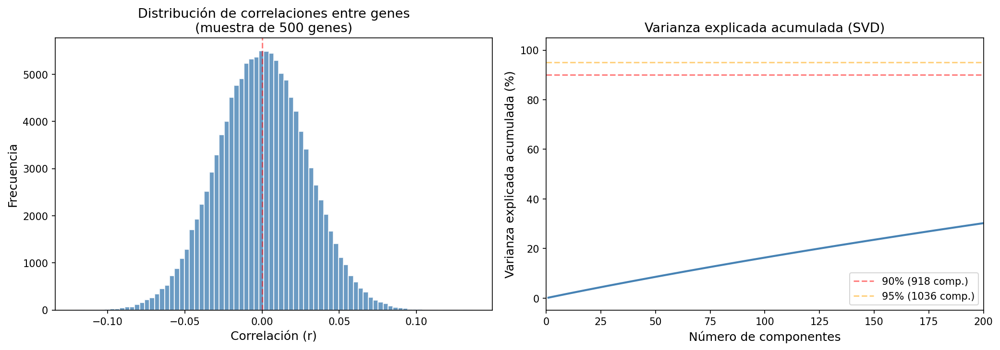
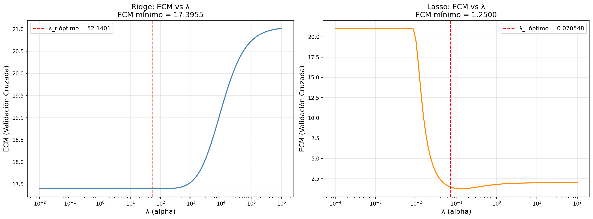
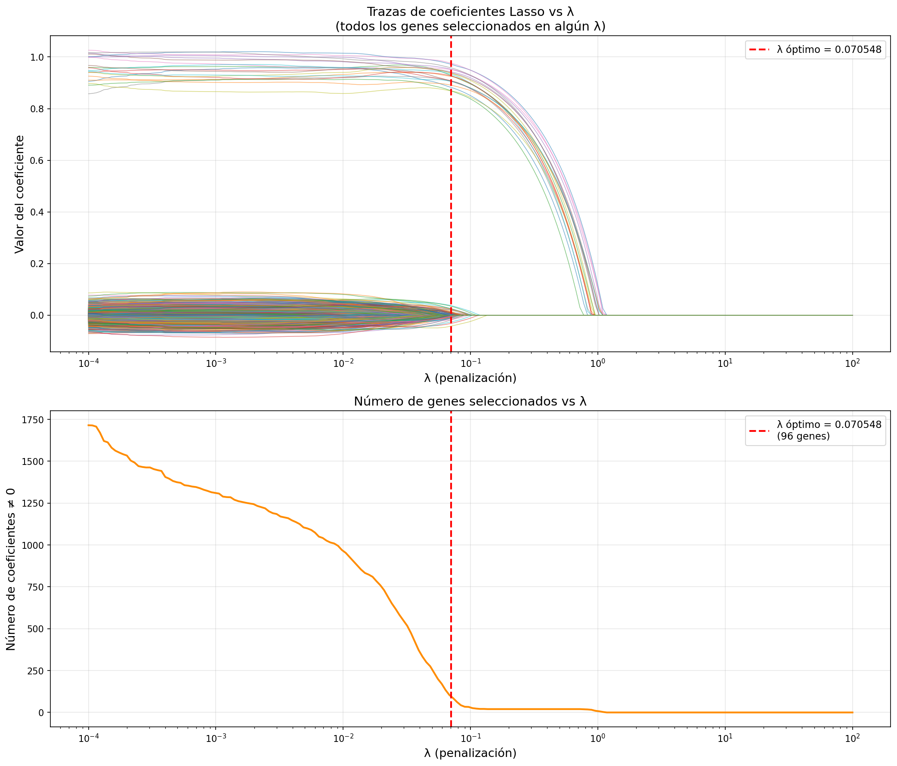

# Taller 1 — Regresión Regularizada en Datos Genómicos

**Asignatura:** Análisis Avanzado de datos, por el profesor Andrés Nicolás López.
**Estudiantes:** Stefany Mojica, Sara Castillejo y Juan Sebastián Rodríguez.
*Maestría en Matemáticas Avanzadas y Ciencias de la Computación*
*Universidad del Rosario*

## Problema

El conjunto de datos `taller1.txt` contiene el perfil genómico de **1200 líneas celulares**
como modelos de cáncer. Se busca determinar cuáles de los **5000 genes** son relevantes
para predecir la efectividad del tratamiento anticáncer (variable continua).

**NOTA:** para correr correctamente este código, se debe agregar manualmente el archivo `taller1.txt` al clonar el repositorio. Dejamos aquí debajo un resumen solo con los resultados para una revisión rápida, pero en el archivo .py está el análisis completo.

---

## Punto 1 — Multicolinealidad

**¿Hay multicolinealidad en los datos?**

Sí. Las evidencias son:

| Indicador                     | Valor            | Interpretación                     |
| ----------------------------- | ---------------- | ---------------------------------- |
| Dimensionalidad               | p=5000 >> n=1200 | X'X no es invertible               |
| Rango de X                    | 1200 de 5000     | 3800 dependencias lineales exactas |
| Número de condición           | 2.89             | >> 30, multicolinealidad severa    |
| Componentes para 90% varianza | 918 de 5000      | Alta redundancia entre genes       |



---

## Punto 2 — Partición de datos 

| Conjunto      | Observaciones |
| ------------- | ------------- |
| Entrenamiento | 1000          |
| Prueba        | 200           |
| **Total**     | **1200**      |

- Semilla utilizada: `2026`

---

## Punto 3 — Selección de λ por validación cruzada

Método: **10-Fold Cross-Validation** sobre los 1000 datos de entrenamiento.

| Método | λ óptimo  | ECM (CV)  | Genes activos |
| ------ | --------- | --------- | ------------- |
| Ridge  | 52.140083 | 17.395507 | 5000          |
| Lasso  | 0.070548  | 1.249969  | 117           |



---

## Punto 4 — Ajuste con λ óptimos

Modelos ajustados sobre los **1000 datos de entrenamiento**.

| Métrica           | Ridge     | Lasso    |
| ----------------- | --------- | -------- |
| λ óptimo          | 52.140083 | 0.070548 |
| ECM entrenamiento | 0.002765  | 0.929672 |
| Genes activos     | 5000      | 117      |

---

## Punto 5 — Selección del mejor modelo

Criterio: **ECM sobre los 200 datos de prueba** (uso único).

| Métrica       | Ridge     | Lasso    |
| ------------- | --------- | -------- |
| ECM prueba    | 14.041272 | 1.153541 |
| Genes activos | 5000      | 117      |

**Modelo seleccionado: Lasso**
- Redujo el ECM en un **91.78%** respecto a Ridge.
- Utilizó solo el **2.34%** de los genes que usa Ridge.

---

## Punto 6 — Reajuste con los 1200 datos

Modelo **Lasso** reajustado sobre las **1200 observaciones** con λ = 0.070548.

| Métrica             | Valor        |
| ------------------- | ------------ |
| λ utilizado         | 0.070548     |
| Datos usados        | 1200         |
| ECM de ajuste       | 1.000033     |
| Genes seleccionados | 96 de 5000   |
| Genes descartados   | 4904 de 5000 |

---

## Punto 7 — Trazas de coeficientes

Se graficaron las trazas de los coeficientes del modelo Lasso en función de λ para los 1200 datos.



**Observaciones:**
- A medida que λ aumenta, los coeficientes se reducen progresivamente hacia cero (regularización L1).
- Con λ muy pequeño se obtiene un modelo complejo; con λ muy grande, un modelo nulo.
- En λ óptimo = 0.070548, se seleccionan 96 genes que balancean ajuste y parsimonia.

---

## Punto 8 — Conclusiones generales

El estudio buscaba identificar cuáles de los 5000 genes son relevantes para predecir la efectividad de un tratamiento anticáncer en 1200 líneas celulares. Dado que p > n, se confirmó multicolinealidad perfecta, lo que justificó el uso de métodos regularizados. Se compararon Ridge y Lasso mediante validación cruzada 10-fold sobre 1000 datos de entrenamiento, encontrando que Lasso (λ = 0.070548) superó significativamente a Ridge al reducir el ECM de prueba en un 91.78% mientras seleccionaba solo 117 genes frente a los 5000 que retiene Ridge. 

Al reajustar el modelo Lasso con los 1200 datos completos, se seleccionaron 96 genes relevantes de los 5000 disponibles. Las trazas confirman que el λ óptimo logra un equilibrio ideal entre precisión y simplicidad: los genes que resisten la penalización son los biomarcadores más determinantes para el tratamiento.

En conclusión, Lasso demostró ser una gran herramienta para esté problema de alta dimensionalidad.
---

## Reproducibilidad
```bash
pip install -r requirements.txt
python taller1.py
```

**Semilla global:** `2026`
